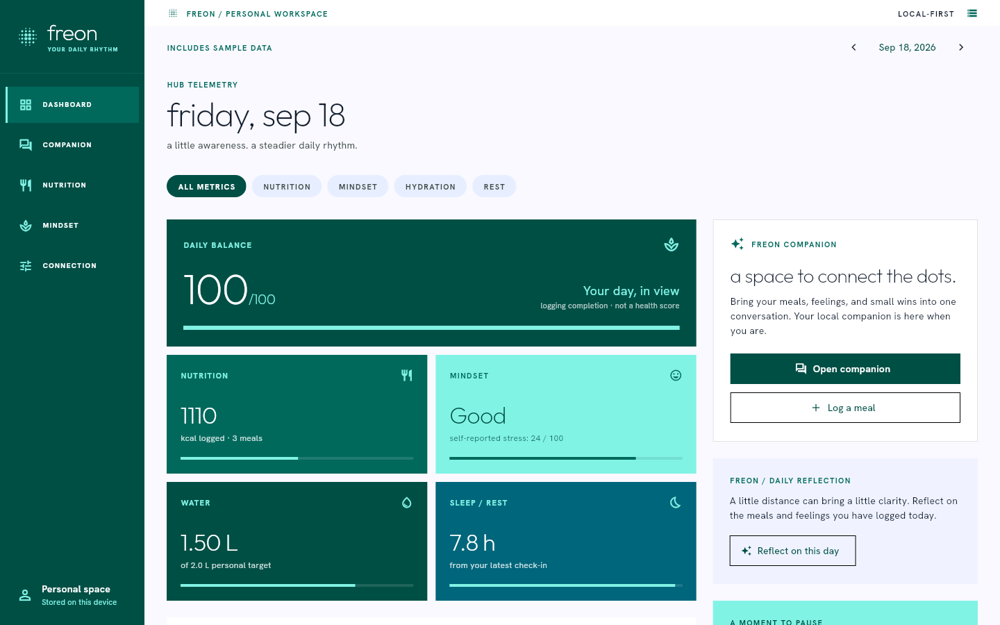

# Freon

A local-first nutrition and wellness companion, built in Flutter for the Synora hackathon.



## The Problem

Meals, mood notes, and daily habits often live in separate apps. It is hard to
reflect on the day as a whole, especially when tracking itself feels like work.

## Our Solution

Freon brings a meal log, hydration tracker, journal, and local AI conversation
into one desktop workspace. The interface follows our Stitch Metro Material
designs: flat teal tiles, thin Outfit headings, and compact Hanken Grotesk labels.

**This milestone targets Linux.** The frontend and local middleware are ready
for hands-on testing before the Android build.

## How It Works

```text
Flutter screens → Riverpod → repositories → SQLite
                         ↘ LM Studio's local HTTP API
```

Meals, check-ins, water entries, settings, messages, and reflections survive
restarts. Database writes update the screens through Drift streams. Calorie and
water totals are calculated in Dart; the dashboard's balance indicator measures
logging completion, not a clinical health score.

The app starts with an empty personal workspace. **Load sample day** in Connection
adds labelled synthetic records. **Clear sample data** removes those fixtures
while preserving personal entries. Sample AI conversations are not fabricated.

## AI

Freon connects to LM Studio's OpenAI-compatible API for streaming text chat and
daily reflections. It supplies recent messages and the selected day's logs as
context. Failed or interrupted responses remain retryable, and editing daily
logs invalidates their saved reflection.

The app works for manual logging when LM Studio is stopped. Nutrition values
are user-entered in this milestone; attached photos are stored locally.
Automatic vision-based nutrition extraction is still to be implemented.

The HTTP client and orchestration are tested against local test servers and
controlled streams. **Real-model behavior has not yet been verified** because
LM Studio was not running during this build.

## Tech Stack

- Flutter / Dart, Linux runner
- Riverpod for state and in-process orchestration
- Drift / SQLite for local storage
- Dart HTTP client for LM Studio and SSE streaming
- Locally bundled fonts and images; no runtime CDN dependencies

## Running It

Developed with Flutter **3.47.4** and Dart **3.13.3**. A working Flutter Linux
toolchain is required (`flutter doctor -v`): Clang, CMake, Ninja, pkg-config,
GTK 3 development libraries, and a C++ toolchain. The photo picker uses your
desktop's XDG file chooser portal.

```bash
flutter pub get
flutter run -d linux
```

Build a distributable Linux folder:

```bash
flutter build linux
./build/linux/x64/release/bundle/freon
```

Keep the **whole `bundle/` folder** together, including its `data/` and `lib/`
directories. Building does not require LM Studio to be running.

### Connecting LM Studio

1. Load a text model in LM Studio and start its local server.
2. Open **Connection** in Freon. The default is `http://127.0.0.1:1234`.
3. Click **Test connection**, select a text model, and **Save settings**.
4. Open **Companion** and send a message.

The vision model field is reserved for the next integration milestone. If your
LM Studio server requires a token, set `FREON_LM_TOKEN` in the process environment
before launching. Tokens are not stored in SQLite. `.env.example` documents
optional environment variables; Freon does not automatically load `.env` files.

By default, records live in the Linux application-support directory, normally
`~/.local/share/app.freon.freon/`. Set `FREON_DATA_DIR` to use a separate workspace
for a demo. Photos are copied into its `photos/` folder. Freon stores local data
as ordinary files; it does not claim database encryption.

## Demo Walkthrough

1. Open **Connection → Load sample day**, then return to **Dashboard**.
2. Visit **Nutrition**, add a meal, and change its nutrition values using its
   action menu. Add a glass of water.
3. Visit **Mindset**, save a check-in and a short journal entry. Try the breathing
   timer; pause and resume it.
4. With LM Studio running, start a real conversation or generate a daily
   reflection. Without it, show the connection error and continue using logs.
5. Restart Freon to show that the records persist.

## What We Built During the Hackathon

- Five native desktop screens adapted from the team's Stitch/HTML references.
- Local meal CRUD, photo attachments, journal CRUD, hydration add/undo, and
  configurable targets with validated inputs.
- A single SQLite repository and Riverpod providers, with no backend service.
- Streaming chat with bounded history, retry, cancellation, and recovery of
  interrupted messages on startup.
- Explicit sample-data handling and honest missing-data states.
- Linux interaction tests, persistence tests, HTTP contract tests, and visual
  regression baselines at 1440×900. Layouts also tested at 1280×800 and 800×600.

Run the checks:

```bash
flutter analyze
flutter test
flutter test integration_test/linux_flow_test.dart -d linux
```

On a headless Linux machine, wrap the last command in
`xvfb-run -a -s "-screen 0 1440x900x24"`.

After changing the database schema, regenerate the checked-in Drift code:

```bash
dart run build_runner build
```

## What We'd Build Next

First, test and debug this Linux milestone with the team and a real LM Studio
model. Then add validated food-image estimates and build the Android companion.
The stream processor, phone/desktop synchronization, and on-device inference
will be designed separately once their requirements are agreed.
